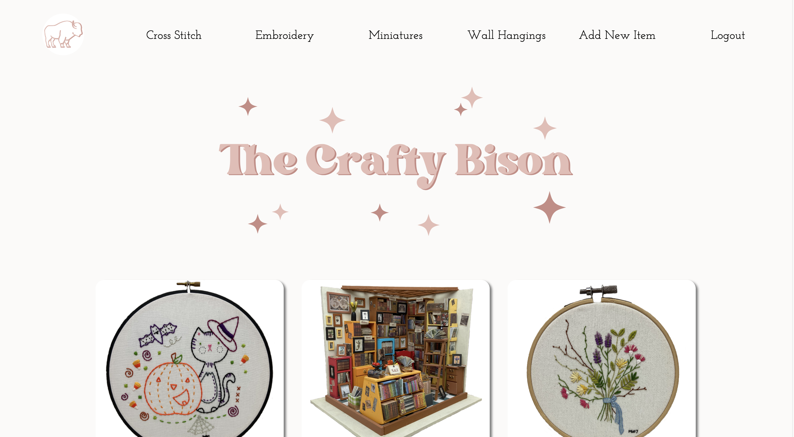

# The Crafty Bison
The Crafty Bison is a full CRUD React application I built for my front-end capstone at Nashville Software School. It was built as a portfolio to display creative projects I have made over the years.

## Overview
Crafty Bison users have the ability to create a profile as a store owner or customer. All users can view and sort items by type and view each item for further details. "Employees" have the added ability to edit, delete and add new items to the store. 

## Demo
https://www.loom.com/share/1586bcc1d81849858a2d31318c312cb9

## Technologies
Tech: HTML, CSS, Javascript and React

## Relevant Links
ERD: https://dbdiagram.io/d/637276bfc9abfc6111728eb7

Wireframe: https://www.figma.com/file/jhPONgvYZoDVrS8JJJT4SV/The-Crafty-Bison-Wireframe?t=MxMTVImgXl9Pb8Ae-6

## Screenshots
Login Page:

Homepage (Employee View):

Add Item Form:

Edit Item Form:

Item Details View:

